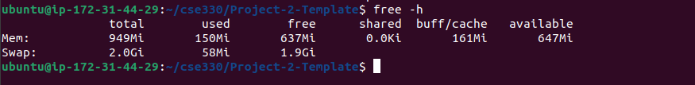
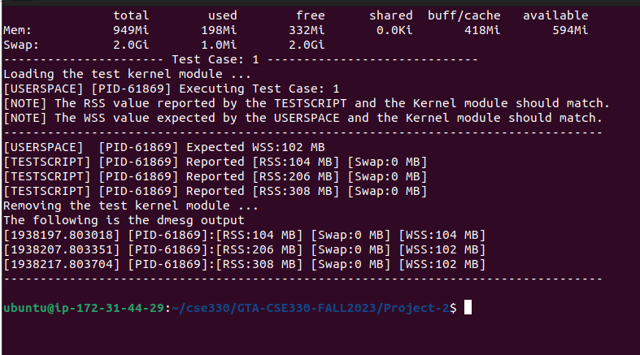
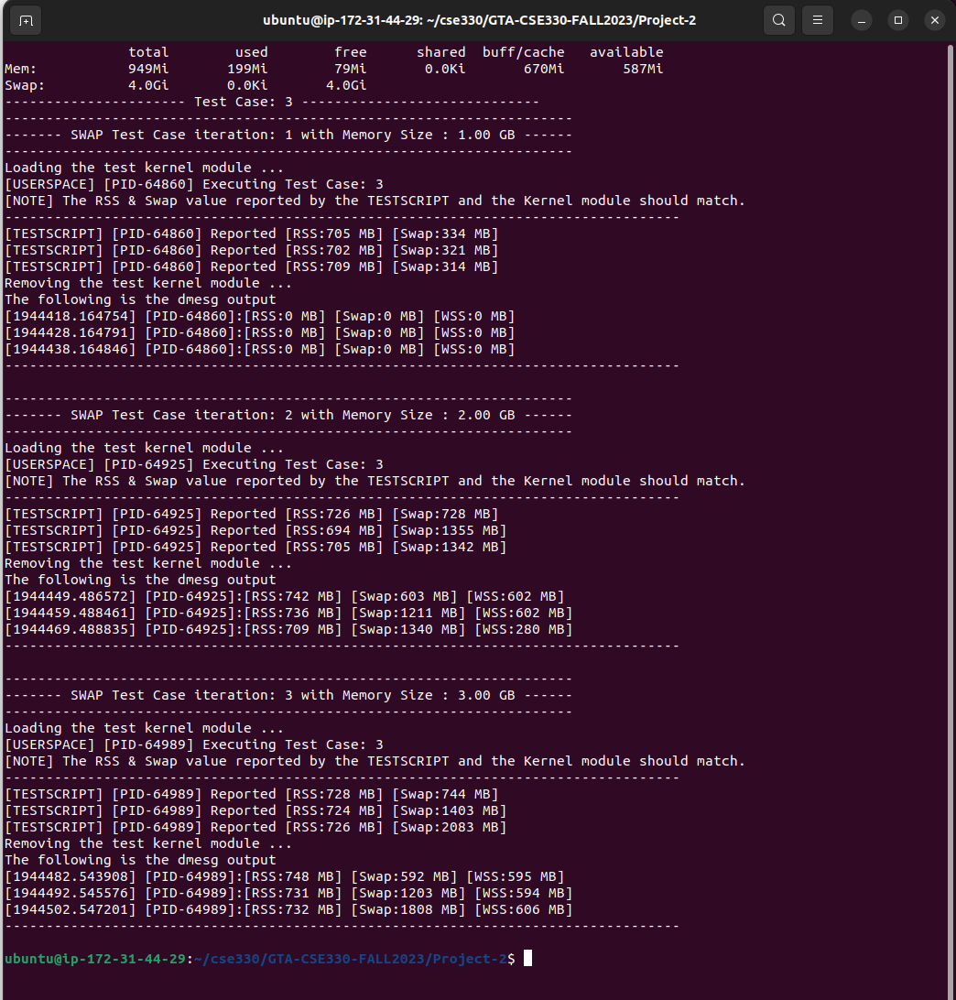

# CSE330: Operating Systems 

Please follow the below steps to test your Project-2. 

- Download the zip of this git repository.
- Unzip the repository.
- Implement your kernel module code in the memory\_manager.c (i.e. all //TODO part, DO NOT change any other part).
- Run the test.sh script with the test arguments. 

## Test Cases:

| Test Case #   | Test Command  | Test Criteria  | Total Points |
| ------------- |:-------------:| :-----:|:-----:|
| 0 | free -h | The available memory size of your VM is **larger than 500MB** (5 pts), and your VM has enough swap spaces (e.g. Swap = 2 GB). (5pts) | 10 |
| 1 | sudo ./test.sh 1 | The **RSS** results from your kernel module output should be 100 MB (5 pts), 200 MB (5 pts), and 300 MB (5 pts), and all **WSS** results should keep as 100 MB (5 pts) | 20 |
| 2 | sudo ./test.sh 2 | The **WSS** results from your kernel module output should be 300 MB (5 pts), 200 MB (5 pts), and 100 MB (5 pts), and all **RSS** results should keep as 300 MB (5 pts) | 20 |
| 3 | sudo ./test.sh 3 | **Bonus**! The RSS + SWAP results from your kernel module output should match memory pressure. For iteration 1, SWAP size should be 0 (5 pts). For iteration 3,SWAP size should be larger than 0 (5 pts). | **1 extra point of your CSE330 final total grades** |

## Note: 
- For the **bonus** part (Test case 3), to make SWAP be used, you may need to either shrink your memory size or modify test.sh scripts. If your VM cannot start after shrinking, you need to increase the memory back and then modify test.sh to increase the test pressure (Default pressure is 1GB, 2GB and 3GB).
- You can use print statements in case you want to debug and understand the logic of the test code.
- Please get in touch with the TAs if you face issues in using the test scripts.

## Sample Output Screenshots:

### Test Case 0

### Test Case 1

### Test Case 2

### Test Case 3

